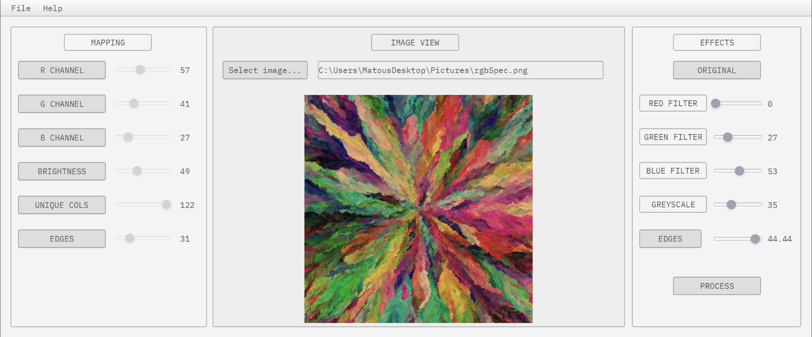
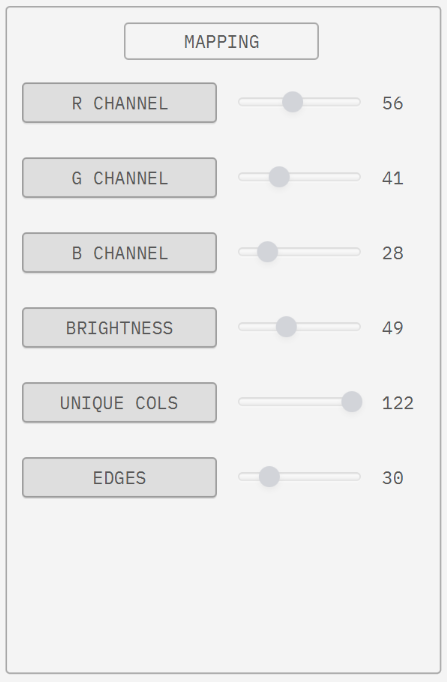
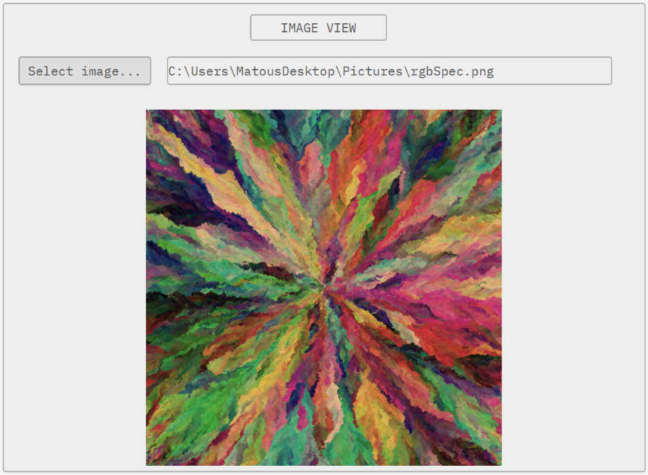
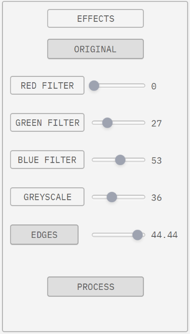

### DrawSound - *MIDI instrument based on an image output*

>“All sounds of the Earth are like music.” Oscar Hammerstein

The goal of this project was to create a tool that opens new possibilities of music-making and music production not only
 to the users with prior musical education. The result is an application that allows its user to upload an image, then 
 calculates the values of selected image characteristics and sends these values to a host digital instrument in a form of 
 MIDI Control Change Messages.  It is then up to the users, how use these messages but the idea is to map these messages 
 either to parameters of a synthesizer and use this application as a source of new sounds in sound designing, or to parameters
  of some effects (eg. reverb, delay, phaser, chorus, etc…). The user also has an option to perform some simple 
  modifications to the image via effects in the application. This action has an impact on values of image characteristics.

#### Interface
It contains a simple user-friendly interface which consists of 3 main tabs

##### Mapping tab

The mapping tab is located on the left hand side. Here you can map each image characterist to any software instrument or 
DAW of your choice. you want to. This is done by simply selecting *"Learn MIDI Assignment"* for any control within your 
software instrument or DAW and then clicking a button with name of the image characteristic you want to map to this control.
When the button turns blue, the mapping is in progress and DrawSound is sending mapping data to your instrument. Once you see 
in the instrument that mapping was done, click the button again to turn off the mapping. The button turns grey again.

The sliders and labels show the current value that is being sent in a MIDI CC message of corresponding characteristics.

##### Image view tab

The image view tab is located in the center of the application and serves the purpose of loading and displaying the input image. 
Simply click the *"Select image..."* button to open the file chooser and select some *.jpg or *.png file. The file path 
to the image is displayed in the text box next to the button and the image right below.

##### Effects tab
The effects tab is located on the right hand side. With *"Red filter"*, *"Green filter"* and *"Blue filter"* you can 
filter out corresponding color from the picture. Sliders allow for adjusting the strenght of each effect. 0 means no effect 
applied, 100 is full strength of the effect.

The *"Greyscale"* button turns the image into greyscale. The slider allows for adjusting the strenght of the effect. 0 means 
no effect applied, 100 is full strength of the effect.

The *"Edges"* button previews the output of the edge dection algorithm, that is used as one of the image characteristics. 
The slider next to the button allows you to set the strength of the edge detection. Higher it is, bigger must be the color 
difference between two pixels to create an edge.

The *"Original"* button restores the displayed image back to the original and resets the effects.

The *"Process"* button applies the effects and recalculates the image characteristics.

#### Setup
The user can either compile the code by themself or use the *.jar* file located in *out/artifacts/DrawSoundFX_jar*